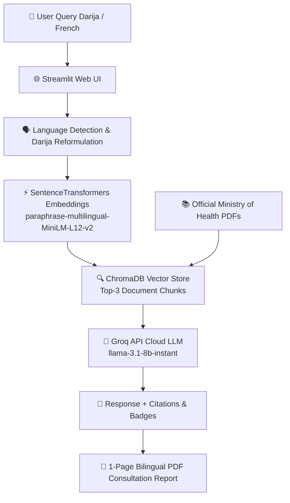

# 🩺 Tbibk (طبيبك) - Assistant Médical Intelligent RAG pour le Contexte Marocain 🇲🇦


**Tbibk (طبيبك)** est une application Web médicale intelligente basée sur l'architecture **RAG (Retrieval-Augmented Generation)**, spécifiquement conçue pour le contexte sanitaire du Royaume du Maroc.

Le système interroge exclusivement les guides et manuels de recommandations officiels publiés par le **Ministère de la Santé et de la Protection Sociale du Maroc** (`sante.gov.ma`). Il prend en charge les requêtes exprimées en **Français** ainsi qu'en **Darija marocaine (الدارجة)** (transcrite en caractères arabes ou en Arabizi/chiffres), tout en éliminant les risques d'hallucination grâce à un ancrage documentaire strict.

---

### 🌟 Fonctionnalités Clés

- **💬 Chatbot Médical RAG Hybride :** Réponses médicales instantanées basées sur les guides officiels du Ministère de la Santé du Maroc.
- **🌐 Détection & Traduction de la Darija 🇲🇦 :** Module de détection automatique pour la Darija et l'Arabizi (`kifach n3erf rassi...`) avec reformulation médicale et badge indicateur.
- **⚡ Inférence Ultra-Rapide (Groq API) :** Modèle Cloud `llama-3.1-8b-instant` via l'API Groq garantissant des réponses complètes en moins de 2 secondes.
- **🔒 Confidentialité de Session :** Gestion de la mémoire isolée par navigateur via `st.session_state` (0 fuite de données entre visiteurs).
- **⚖️ Calculateur d'IMC (Indice de Masse Corporelle) :** Évaluation personnalisée du poids et conseils nutritionnels selon les normes de l'OMS et du Maroc.
- **💓 Évaluateur du Risque Cardiovasculaire (HTA) :** Estimation du risque hypertensif selon les critères cliniques officiels (Score HTA/OMS).
- **📄 Fiche Patient Officielle (PDF Bilingue) :** Génération dynamique en 1 clic d'un rapport de consultation avec en-têtes officiels en Français et en Arabe (*ROYAUME DU MAROC / المملكة المغربية*).

---

## 📐 Architecture du Pipeline RAG



---

## 📁 Structure du Répertoire

```
medical RAG chatbot/
│
├── app.py                      # Application Streamlit principale (UI Thème Bleu #549FC4)
├── requirements.txt            # Dépendances Python (Streamlit, ChromaDB, Sentence-Transformers, ReportLab)
├── README.md                   # Documentation officielle du projet
│
├── assets/                     # Ressources graphiques et médias
│   ├── 3d_chat_icon.png        # Icône 3D - Chatbot Tbibk
│   ├── 3d_heart_icon.png       # Icône 3D - Risque Cardiovasculaire
│   ├── 3d_imc_icon.png         # Icône 3D - Calculateur IMC
│   ├── 3d_report_icon.png      # Icône 3D - Fiche Patient
│   ├── tbibk_logo.png          # Logo officiel Tbibk (Transparent)
│   ├── arabic_header_v2.png    # En-tête officiel arabe du PDF
│   └── tbibk_rag_architecture.jpg # Diagramme d'architecture RAG
│
├── src/                        # Modules RAG et moteur applicatif
│   ├── config.py               # Chemins d'accès et configuration des modèles
│   ├── downloader.py           # Scraping des guides officiels du Ministère
│   ├── extract_pdf.py          # Extraction brute du texte via PyMuPDF
│   ├── parser.py               # Découpage sémantique (Chunking avec overlap)
│   ├── vector_store.py         # Moteur de recherche vectorielle ChromaDB
│   └── rag_pipeline.py         # Orchestrateur RAG (Routeur Darija + Prompt Groq API)
│
├── documents/                  # PDFs officiels du Ministère de la Santé
├── data_clean/                 # Textes nettoyés pré-extraits (11 guides médicaux)
└── index/                      # Index vectoriel persistant ChromaDB
```

---

## 📚 Guides Médicaux Officiels Indexés

Le système est directement alimenté par 11 guides cliniques officiels du Ministère de la Santé du Maroc :
1. **Guide National de la Nutrition** (`guide_nutrition.pdf`)
2. **Prise en Charge de l'Hypertension Artérielle (HTA)** (`hta_adulte.pdf`)
3. **Guide du Risque Cardiovasculaire** (`risque_cardiovasculaire.pdf`)
4. **Prévention des Complications Hypertensives** (`complications_hta.pdf`)
5. **Affections Respiratoires chez l'Enfant** (`respiratoire_enfant.pdf`)
6. **Guide du Diabète Sucré**
7. **Guide de la Santé Maternelle et Néonatale**

---

## ⚙️ Installation & Lancement Local

### 1. Prérequis
- **Python 3.10** ou supérieur.
- Un compte **Groq API** (gratuit sur [console.groq.com](https://console.groq.com)).

### 2. Cloner le Dépôt
```bash
git clone https://github.com/ahmed-id-machiche/-medical_RAG_chatbot.git
cd -medical_RAG_chatbot
```

### 3. Installer les Dépendances
```bash
pip install -r requirements.txt
```

### 4. Configurer la Clé API Groq
Créez un fichier `.env` à la racine du projet ou définissez la variable d'environnement :
```env
GROQ_API_KEY=votre_cle_api_groq
```

### 5. Lancer l'Application Streamlit
```bash
python -m streamlit run app.py
```
Accédez à l'application sur **[http://localhost:8501](http://localhost:8501)**.

---

## ☁️ Déploiement en Production (Streamlit Cloud)

L'application est pré-configurée pour le déploiement continu sur **Streamlit Community Cloud** :
- **Branche de Déploiement :** `main` / `badge-hunt`
- **Secrets Streamlit :** Ajoutez `GROQ_API_KEY = "votre_cle_api_groq"` dans le panneau *Secrets* de Streamlit Cloud.

---

## 👨‍💻 Crédits & Contact

Projet développé dans le cadre du Master à la Faculté des Sciences d'El Jadida — **Université Chouaïb Doukkali**. 
Tous les guides médicaux référencés sont la propriété du **Ministère de la Santé et de la Protection Sociale du Royaume du Maroc**.
