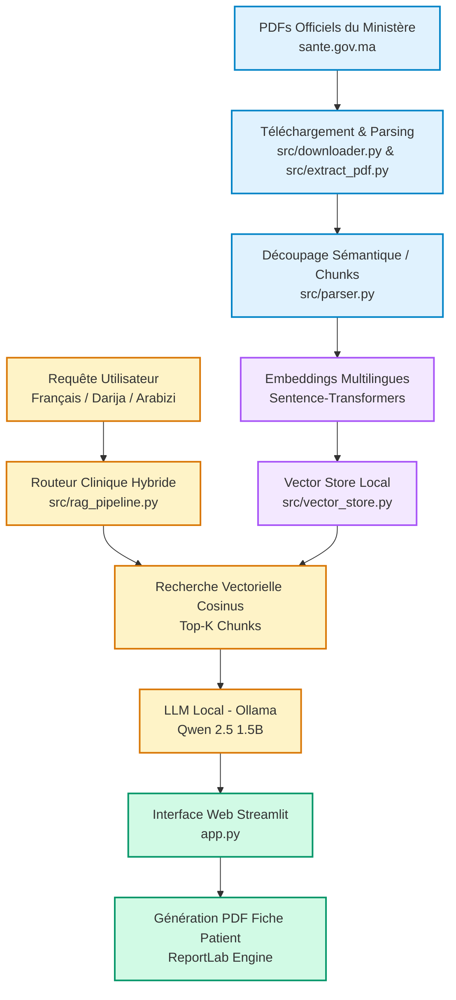

# 🩺 Tbibk (طبيبك) - Assistant Médical Intelligent RAG pour le Contexte Marocain

> **Projet de Fin de Module :** Programmation Python Avancée  
> **Établissement :** Faculté des Sciences, Université Chouaïb Doukkali — El Jadida (Année Universitaire 2025/2026)  
> **Infrastructure :** 100% Local & Hors-ligne (Zero-Data-Leakage)

---

## 📌 Présentation du Projet

**Tbibk (طبيبك)** est une application Web médicale intelligente basée sur l'architecture **RAG (Retrieval-Augmented Generation)**, spécifiquement conçue pour le contexte sanitaire marocain. 

Le système interroge exclusivement les guides et manuels de recommandations officiels publiés par le **Ministère de la Santé du Maroc** (`sante.gov.ma`). Il prend en charge les requêtes exprimées en **Français** ainsi qu'en **Darija marocaine** (transcrite en caractères arabes ou en Arabizi/chiffres), tout en éliminant les risques d'hallucination grâce à un ancrage documentaire strict.

### 🌟 Fonctionnalités Clés
- **💬 Chatbot Médical RAG Hybride :** Réponse aux questions des patients avec indication systématique de la langue source et reformulation médicale.
- **🌐 Routeur Linguistique Marocain :** Module hybride combinant un dictionnaire sémantique déterministe pour l'Arabizi et une traduction guidée par LLM local.
- **⚖️ Calculateur d'IMC (Indice de Masse Corporelle) :** Évaluation personnalisée du poids selon les seuils cliniques officiels.
- **💓 Évaluateur du Risque Cardiovasculaire (HTA) :** Estimation du risque hypertensif selon les critères clinique du score Maroc/OMS.
- **📄 Générateur de Fiche Patient (PDF) :** Compilation dynamique en mémoire (via ReportLab) des paramètres du patient et du transcript de consultation sous forme de document PDF imprimable.
- **🕒 Historique de Discussion Persistant :** Sauvegarde automatique des sessions de chat sur disque sous format JSON.

---

## 📐 Architecture du Pipeline RAG Local



---

## 📁 Structure du Répertoire

```
Projet Python/
│
├── app.py                      # Interface principale Streamlit (Design personnalisé Bleu #549FC4)
├── evaluate.py                 # Script de benchmark et d'évaluation du RAG
├── performance_report.md       # Rapport d'analyse de précision et d'asservissement documentaire
├── requirements.txt            # Dépendances Python (Streamlit, Sentence-Transformers, Ollama, ReportLab, PyMuPDF)
├── run.bat                     # Script de lancement rapide pour Windows
├── README.md                   # Documentation officielle du projet
│
├── 3d_chat_icon.png            # Asset graphique 3D - Chatbot
├── 3d_heart_icon.png           # Asset graphique 3D - Risque Cardiovasculaire
├── 3d_imc_icon.png             # Asset graphique 3D - Calculateur IMC
├── 3d_report_icon.png          # Asset graphique 3D - Fiche Patient
├── tbibk_logo.png              # Logo officiel détouré (Transparent)
│
├── src/                        # Coeur applicatif et modules RAG
│   ├── config.py               # Chemins, URL des PDFs officiels et configuration des modèles
│   ├── downloader.py           # Scraping et téléchargement automatique des guides officiels
│   ├── extract_pdf.py          # Nettoyage et extraction brute des textes via PyMuPDF (fitz)
│   ├── parser.py               # Découpage (chunking) sémantique avec chevauchement (overlap)
│   ├── vector_store.py         # Base vectorielle locale légère (NumPy & Cosine Similarity)
│   └── rag_pipeline.py         # Orchestrateur RAG (Routeur Darija + Prompt Inférence)
│
├── conversations/              # Historique persistant des sessions (Format JSON)
├── documents/                  # Guides et manuels médicaux d'origine (PDFs)
├── data/                       # Extraits textuels sémantiques issus du parsing
└── index/                      # Index vectoriels sauvegardés (vectors.npy & chunks.json)
```

---

## 📚 Sources Documentaires Officiellement Indexées

Le système s'appuie sur 5 guides officiels téléchargeables directement depuis le portail du Ministère de la Santé du Maroc :
1. **Guide National de la Nutrition** (`guide_nutrition.pdf`)
2. **Recommandations de Bonnes Pratiques Médicales - HTA de l'adulte** (`hta_adulte.pdf`)
3. **Guide du Risque Cardiovasculaire** (`risque_cardiovasculaire.pdf`)
4. **Guide de Prévention des Complications de l'HTA** (`complications_hta.pdf`)
5. **Guide National de Prise en Charge des Affections Respiratoires de l'Enfant** (`respiratoire_enfant.pdf`)

---

## 🛠️ Configuration & Installation Locale

### 1. Prérequis Système
- **Python 3.9** ou supérieur.
- **Ollama** (Framework d'exécution LLM local, téléchargeable sur [ollama.com](https://ollama.com)).

### 2. Téléchargement du Modèle LLM Local
Ouvrez un terminal et téléchargez le modèle multilingue optimisé :
```bash
ollama pull qwen2.5:1.5b
```

### 3. Installation des Dépendances Python
Installez les bibliothèques requises via la commande suivante :
```bash
pip install -r requirements.txt
```

---

## 🚀 Démarrage de l'Application

### Méthode 1 : Script Automatique (Windows)
Double-cliquez simplement sur le fichier `run.bat`.

### Méthode 2 : Ligne de Commande
Exécutez la commande Streamlit dans votre terminal :
```bash
python -m streamlit run app.py
```
L'interface est immédiatement accessible à l'adresse : **[http://localhost:8501](http://localhost:8501)**.

---

## 📊 Évaluation & Benchmark des Performances

Pour lancer l'évaluation automatique du taux de rétention d'information et vérifier l'absence d'hallucinations :
```bash
python evaluate.py
```
Le rapport d'évaluation complet est généré et mis à jour dans `performance_report.md`.

---

## 👨‍💻 Crédits & Développement

Projet développé dans le cadre du Master de la Faculté des Sciences d'El Jadida — Université Chouaïb Doukkali. Tous les documents sources appartiennent au Ministère de la Santé et de la Protection Sociale du Royaume du Maroc.
